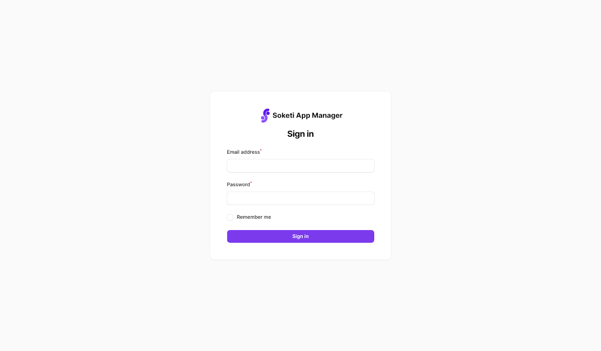
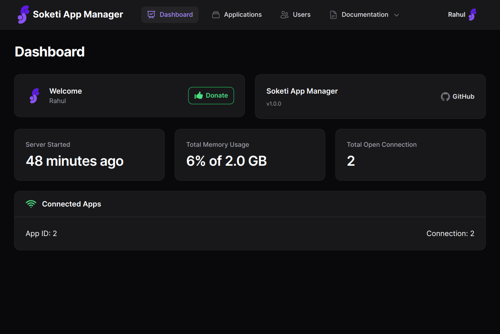
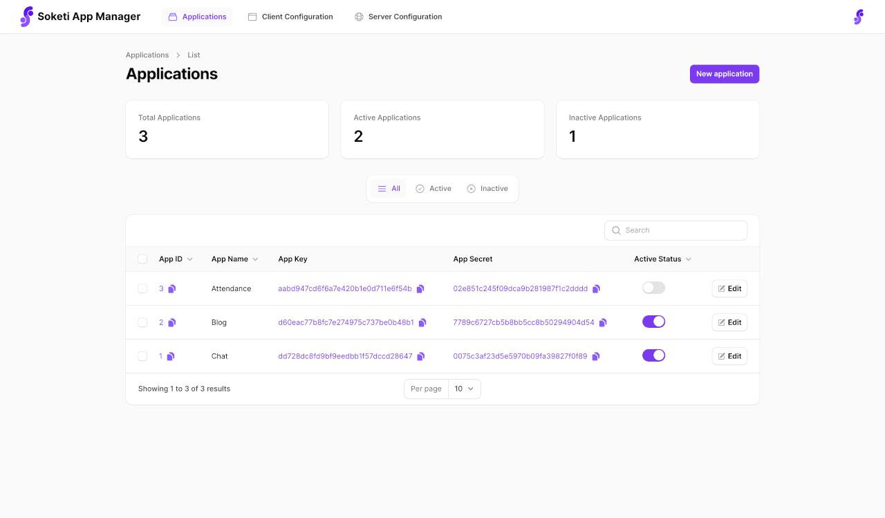
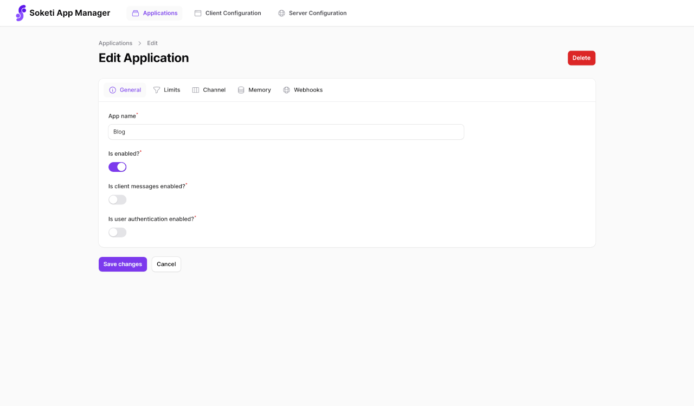

# Soketi App Manager 📡

Simple frontend for [Soketi](https://soketi.app/) websocket server with a intuitive user interface. Made with [FilamentPHP](https://filamentphp.com/) and 💕

**Soketi App Manager** provides a user-friendly interface for managing your Soketi websocket applications. You can effortlessly **create**, **serve**, **view**, **edit**, **delete** and **search** multiple websocket applications, streamlining your app management process. The whole setup process is made simpler so that anyone can easily get started with the Soketi websocket server. 🚀

## Requirements

- PHP^8.1
- Composer^2
- MySQL^8
- Redis^6
- Npm^8

## Installation

```bash
# Clone or download the repo
git clone https://github.com/rahulhaque/soketi-app-manager-filament.git

# Go to the directory
cd soketi-app-manager-filament

# Copy .env.example to .env
cp .env.example .env

# Install dependencies
composer install

# Generate application key
php artisan key:generate

# Migrate database
php artisan migrate

# Create the admin user
php artisan make:filament-user

# Run the application
php artisan serve

# Install soketi websocket server
npm install -g @soketi/soketi

# Copy soketi.json.example to soketi.json
cp soketi.json.example soketi.json

# Run soketi server
soketi start --config=soketi.json
```

## Screenshots

1. Login


2. Dashboard


3. View applications


4. Edit application


## Security

If you discover any security related issues, please email rahulhaque07@gmail.com instead of using the issue tracker.

## Credits

- [Rahul Haque](https://github.com/rahulhaque)
- [Soketi](https://soketi.app/)
- [FilamentPHP](https://filamentphp.com/)
- [All Contributors](../../contributors)

## License

GNU General Public License v3.0. See [License File](LICENSE) for more information.
