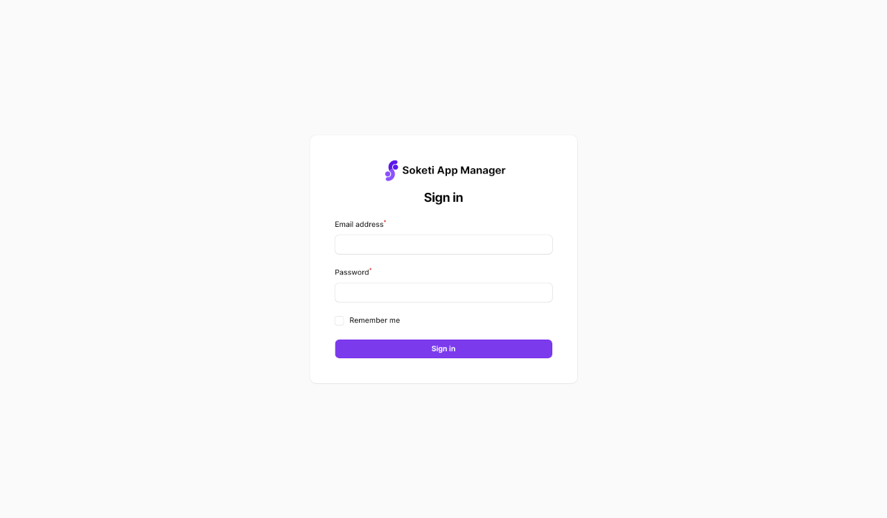
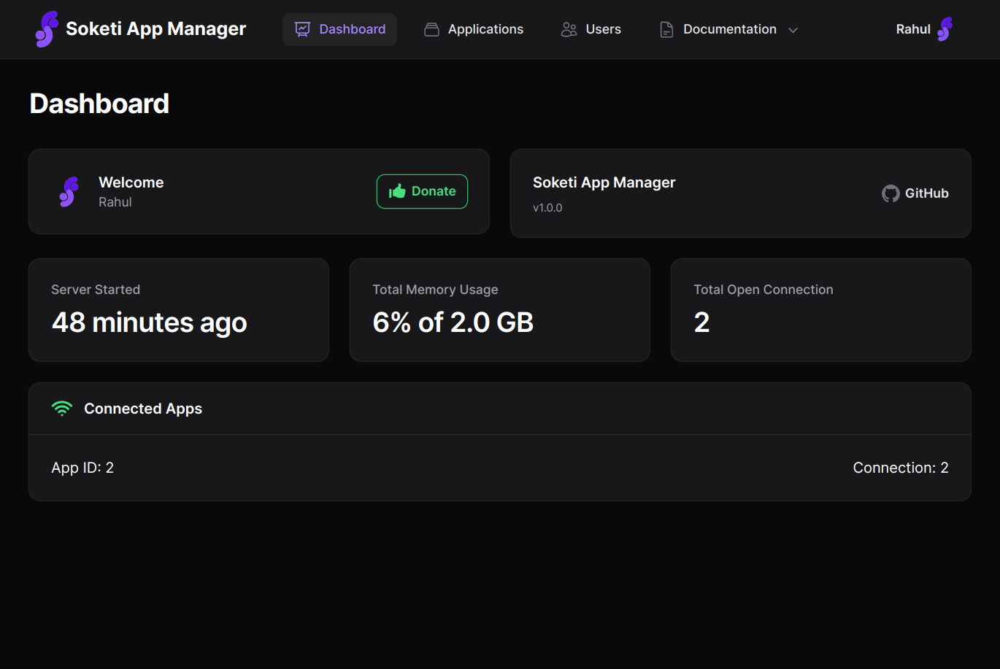
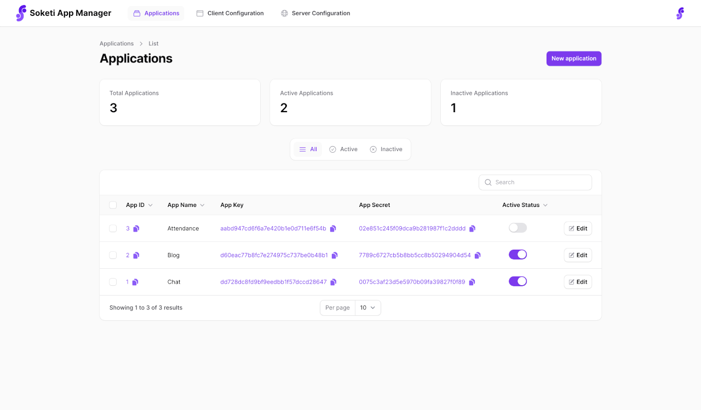
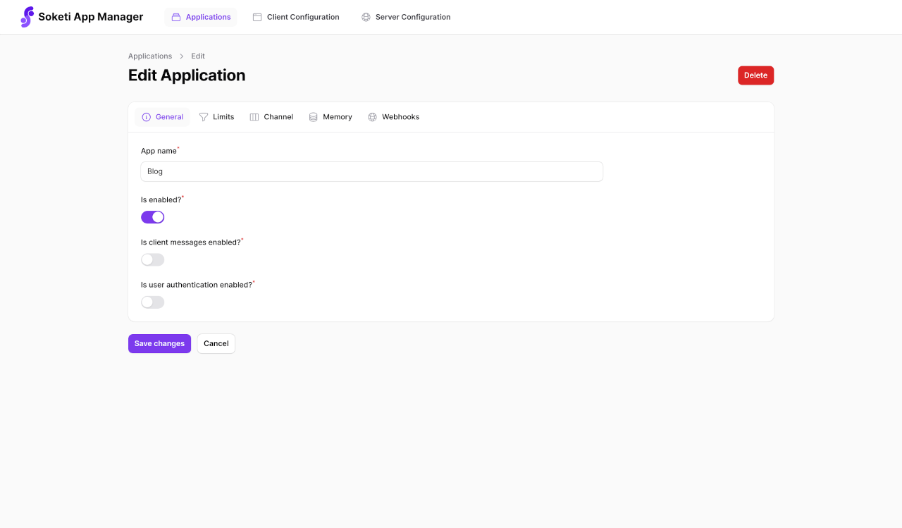

# Soketi App Manager 📡

Simple frontend for [Soketi](https://soketi.app/) websocket server with a intuitive user interface. Made with [FilamentPHP](https://filamentphp.com/) and 💕

**Soketi App Manager** provides a user-friendly interface for managing your Soketi websocket applications. You can effortlessly manage multiple websocket applications, streamlining your app management process. The whole setup process is made simpler so that anyone can easily get started with the Soketi websocket server. 🚀 It currently features -
- Dashboard to show realtime server stats and app connections.
- Dashboard to show realtime Soketi application connections.
- Create and manage (serve, view, edit, delete and filter) multiple Soketi applications.
- Interactive UI for managing Soketi application webhooks.
- Interactive UI for managing webhook headers.
- Interactive UI for managing webhook filters.
- Create and manage multiple users with different roles (Admin/Non-admin).
- Documentation for client and backend integration.
- Light and dark theme.

Support the development with a ⭐ to let others know it worked for you.

I invest a lot of time and effort in open-source. If you like this project, please consider supporting me on [Ko-fi](https://ko-fi.com/W7W2I1JIV). 🙏

[](https://ko-fi.com/W7W2I1JIV)

## Requirements

- PHP^8.1
- Composer^2
- MySQL^8|PostgreSQL^13.3
- Redis^6
- NodeJS^14
- Soketi running with MySQL|PostgreSQL

## Local Installation

```bash
# Clone or download the repo
git clone https://github.com/rahulhaque/soketi-app-manager-filament.git

# Go to the directory
cd soketi-app-manager-filament

# Copy .env.example to .env
# Change needed variables
cp .env.example .env

# Install dependencies
composer install

# Generate application key
php artisan key:generate

# Migrate database
php artisan migrate --seed

# Run the application
php artisan serve

# Install Soketi websocket server
npm install -g @soketi/soketi

# Run Soketi server
soketi start
```

## Docker Installation

Some considerations -

- Port `80` is exposed through nginx by default. Change the `APP_PORT` in `.env` before running `docker compose up -d` if there's conflict.
- Nginx is configured to handle websocket requests as well. No need to expose Soketi port `6001` for websockets. Use the `APP_PORT` instead.

```bash
# Clone or download the repo
git clone https://github.com/rahulhaque/soketi-app-manager-filament.git

# Go to the directory
cd soketi-app-manager-filament

# Copy .env.docker.example to .env
cp .env.docker.example .env

# Change the necessary variables
nano .env

# Build the image
docker compose build

# Run the application
# Give it some time to -
# > Install composer dependencies
# > Generate application key
# > Run database migration
# Press `ctrl-c` when done
docker compose up

# Now run it in background
docker compose up -d

# Drop to application shell
docker compose exec -u soketi soketi-app-manager bash

# Seed database
php artisan db:seed

# Logout from shell
exit

# Visit application
http://localhost:APP_PORT

# Stop the application or
docker compose stop

# Stop and remove the containers
docker compose down
```

## Coolify Installation

Follow the below instructions to deploy this with [Coolify](https://coolify.io/) -

- Create a public repository based application from Coolify dashboard with this url https://github.com/rahulhaque/soketi-app-manager-filament and click `Check repository`.
- Next select `Docker Compose` from `Build Pack` dropdown and click `Continue`.
- Before you set up the environment variables, make sure to create and deploy your preferred **database**, **redis** and **soketi** services. Come back to **soketi-app-manager-filament** service.
- Then copy/paste the related environement variables in Coolify UI except `APP_KEY`.
- `Save` and hit `Deploy`.
- After that go to terminal and run the followin -
```bash
# Keep the key for APP_KEY
php artisan key:generate --show

# Migrate the database
php artisan migrate

# Create an admin user
php artisan make:filament-user --name <your_name> --email <your_email> --password <your_password>
```
- Set the `APP_KEY` environment variable and `Restart` the service. You should be able to login with the user credentials.

## Credentials

```bash
Email: admin@email.com
Password: password
```

## Screenshots

1. Login


2. Dashboard


3. View applications


4. Edit application


## Security

If you discover any security related issues, please email rahulhaque07@gmail.com instead of using the issue tracker.

## Credits

- [Rahul Haque](https://github.com/rahulhaque)
- [Soketi](https://soketi.app/)
- [FilamentPHP](https://filamentphp.com/)
- [All Contributors](../../contributors)

## License

GNU General Public License v3.0. See [License File](LICENSE) for more information.
